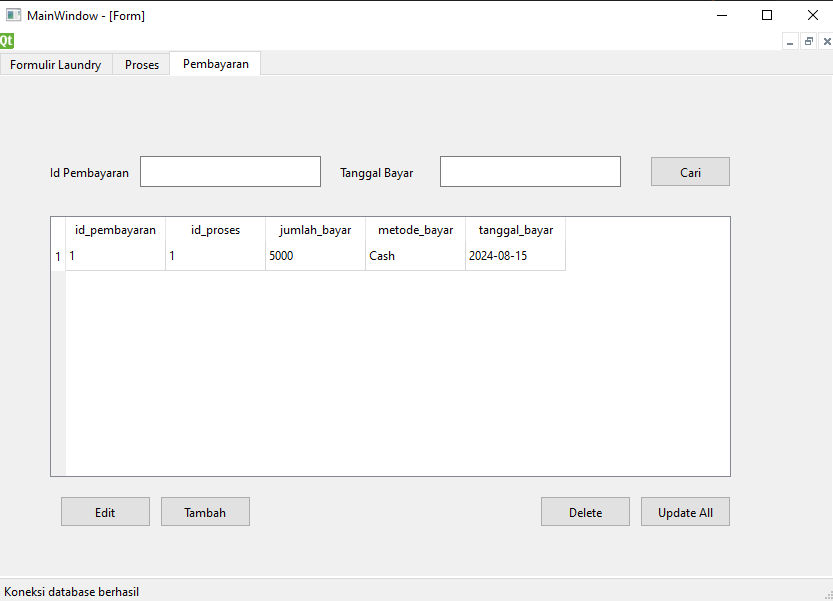

# Laundry App

This is a simple desktop application for managing laundry services, built using PyQt6. The application allows users to manage customer orders, track the status of laundry, and handle payments.

## Features

- **Laundry Form:** Easily create and manage customer orders by adding customer details into the database.
- **Status Tracking:** Keep track of the status of each laundry order (e.g., received, washing, drying, completed).
- **Payment Processing:** Manage and record payments for orders.

## Screenshots

### 1. Laundry Form
This form is used to input customer details and laundry order information.


### 2. Process Management
This screen allows the user to track and update the status of laundry orders.


### 3. Payment Management
This interface is used to record and manage payments for laundry orders.



## Installation

1. **Clone the repository:**
   ```bash
   git clone https://github.com/rrayhka/laundry-app.git
   cd laundry-app
   ```

2. **Install dependencies:**
   Ensure you have Python 3.8+ installed. Install the required packages using pip:
   ```bash
   pip install PyQt6
   ```

3. **Run the application:**
   ```bash
   python main.py
   ```

## Requirements

- Python 3.8+
- PyQt6

## Contact

Rayhka - [khyar075@gmail.com](mailto:khyar075@gmail.com)```
